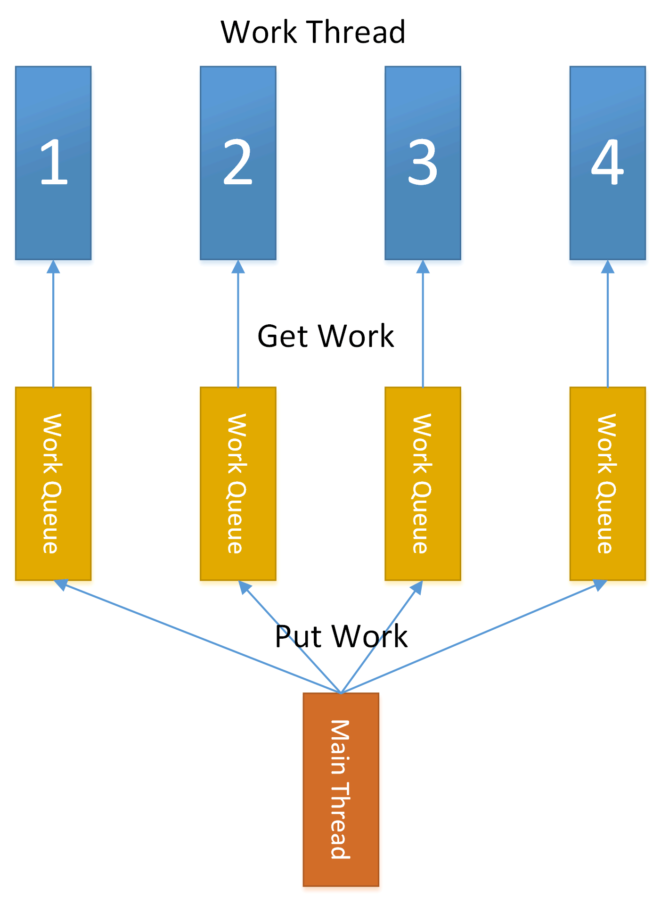

# lockfreepoll

lockfreepoll is a lock-free header-only thread pool, hanle more than 5 million tasks per second, it's much faster than boost threadqueue.

## Features

using lock-free queue to avoid multithreading competing for a single queue.
Task scheduling uses rotation training and minimum load.

how it works



## compile

### linux:

cmake  .

make 

### windows:

execute wincmake generate msvc project.

## example

```c++
#include <iostream>
#include <atomic>
#include "ThreadPool.h"
using namespace std;

class TestTask :public ITask{
public:
    virtual ~TestTask(){}

    bool on_init() override {
        return true;
    }
    void on_process() override{
        int a = 1+2;
    }
    void on_end() override {
        delete this;
    }
};
void addfunc_thread(void *args) {
    CThreadPool *th_pool = (CThreadPool *) args;

    auto start = std::chrono::high_resolution_clock::now();

    for (int i = 0; i < 100 * 10000; ++i) {
        TestTask* task = new TestTask;
        if (!th_pool->add_work(task)) {
            --i;
            continue;
        }
    }

    auto elapsed = std::chrono::high_resolution_clock::now() - start;
    std::cout << "waited for "
              << std::chrono::duration_cast<std::chrono::milliseconds>(elapsed).count()
              << " ms\n";
}

int main(int argc, char**argv) {
    CThreadPool th_poll;
    th_poll.init(6, ScheduleType::LEAST_LOAD, 10);
    std::thread th(addfunc_thread, (void*)&th_poll);
    th.join();

    th_poll.stop();
    th_poll.join();
	return 0;
}
```

